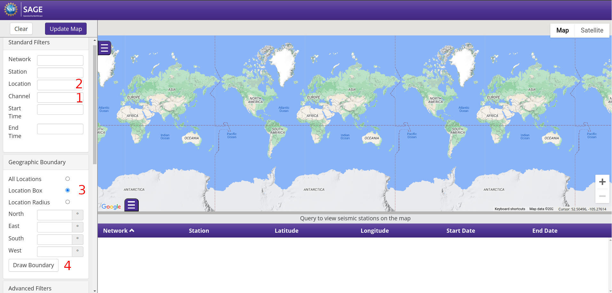
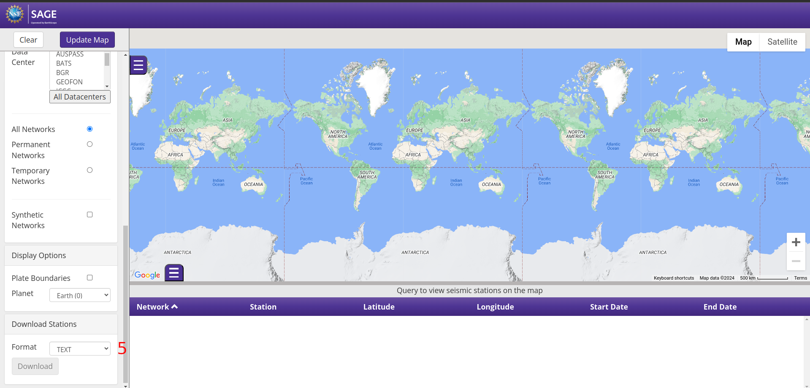

# Description

The following repository is a set of programs which can be used for calculating randomness amplification presented in the paper (LINK). The seed of randomness is the ground vibration noise gathered from seismic aparatures placed all over the word.

## Usage of the program

The programs are desinged for Linux platform. However,  for Windows oriented users one recommends Windows Subsystem for Linux [WLS](https://learn.microsoft.com/en-us/windows/wsl/about).

## Downloading data

1. Download gmap-stations.txt file with list of stations from the [website](https://ds.iris.edu/gmap/). The instructions how to do it is written below:

    On the left side of the webpage one can fill the form to filter searching data. For our purpose it is enough to focus on 5 fields numbered on the below screenshots. In gap 1 one puts symbol of channels. Because we are focused on registered vibration noise (humans' or animals' movement, traffic etc.) not earthquakes, the recommendation is to:

    1.1. Choose stations close to big humans' clusters like metropolis or big cities. Use **Location box** radio button (3) and **Draw Boundary** button (4) to limit a searching area.

    1.2. On the [website](https://scedc.caltech.edu/data/station/seed.html) the is a list of channels. For vibration noise the best choice are channels having two features: **continuous recording** and big number of **sps (samples per second)** 20,40,80 or 100. They are for example: BH[ZNE], BH[789], BJ[ZNE], EH[123], HJ[ZNE].

    1.3. In the location gap (2) write symbols from the following list: 00, 01, 10, 11.

    1.4. Choose TXT format from dropdown list in section **Download stations** (5).

    
    

2. The file gmap-stations.txt should be placed in the current folder with the other files.
 Write **make data** in terminal, the following menu appers:

    1. Create stations.txt file from gmap-stations.txt
    2. Fetch data from stations in stations.txt
    3. Transform mseed files to ascii files
    4. Create dataNoise.ascii file

    Point 1

     To download the data from the stations, first one has to transform gmap-stations.txt file into a form required in the script fetch_data_script.sh. Choosing 1 in the above menu one executes program stationsFileCreator.py. which makes this transformation. At the begining the program asks for a list of channels (Input channel symbols separated by comma) and for location codes (Input location codes separated by comma). Both of these lists should be either equal to the list put in the filter area on the [website](https://ds.iris.edu/gmap/) (look at point 1.1) or be a subset of it. Number of entries in stations.txt file is equal to the number of found stations multiplied by length of the list of channels and the length of the list of location codes.

     Point 2

    If the stations.txt file has been created one can execute script fetch_data_script.sh, which downloads data. Take into account that it is likely that downloading data may take long time (up to several days).

    **Remember that the script must be run with two additional files: fetch_data (perl) and fetch_dayloop.sh**

    The program asks a user the following set of questions:

    1. Do you want to turn off the computer after downloading data? (Y/N)

        Downloading data usually takes much time. Press Y if needed.

    2. Enter START date (yyyy.jdy)

        Symbol yyyy means four digits of the year and jdy means three digits of the day of chosen year being  begining of the period from which one wants to gather the data.

    3. Enter END date (yyyy.jdy)

        Like above, however for the end of the period.

    4. Declare the maximum time in hours between time points in the period in which the data is downloaded

        The time (in hours) between START date and END date is divided to $n$ periods according to the rule
        $$ n=\begin{cases}
        \big\lceil{24\cdot d \over h}\big\rceil, & \text{if }\  24\cdot d> h\\
        1, & \text{if }\  24\cdot d\leq h,
        \end{cases}$$
        where $d$ is the number of days between START and END date and $h$ is the declared maximum time (in hours) between time points in the established period. The program creates $n$ folders for every time period. In each folder there is data registered in $h$ hours starting from the given time point. However, in the case where $h$ does not devide $24\cdot d$ in the last folder there is data gathered during $(24\cdot d)\ mod \ h$ hours.

        **Example**

        One wants to download data between 01.01.2020 and 2.01.2020 every 5 hours. There will be 5 time points : 00:00 a.m, 05:00 a.m,10:00 a.m.,3:00 p.m., 8:00 p.m. and the user's input is

        START date: **2020.001**

        END date: **2020.002**

        Declare the maximum time in hours between time points in the period in which the data is downloaded: **5**

        The program will create 10 folders for downloading data. In the 9 folders there will be data registered in 5 hours and in the last one in 3 hours.

        Notice that the created list of time periods are written in the file date.txt. If for any reason the downloading process interrups then, after the restart, the program will start to download data from the date at begining of the list and add a new declared time periods to its end. To avoid such a situation one can modify or delete the date.txt file before the restart of the program.

     Point 3

     Downloaded data has to be transfomed from mseed file into ascii file. The ascii data format is required by the program calculating randomness. Besides .mseed file, for a proper conversion to .ascii the program demands .xml file. Both should have the same name including the name of a station, the symbol of a channel and the timestamp. At the begining the program cleans the download data. It checks if there are any files which are 0 bytes and if every .mseed  file has .xml counterpart.  In such a case founded files are deleted. Next,  a folder named Data_ascii  is created. In the folder a pair of .mseed and .xml files is transformed to one .ascii file.

     Point 4

     The last step in preparation of data to calculating randomness amplification is creation of one dataNoise.ascii file, which is the input file of the main program. The file dataNoise.ascii simply gathers all data from  previously created .ascii files.

## Calculating epsilon

Write  **make rand**. The script has its own manual.
